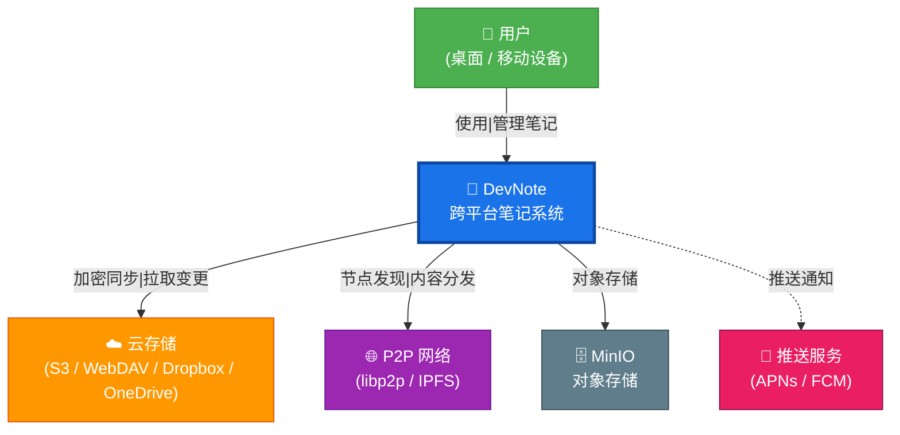

# DevNote C4 架构模型

> 本文档使用 C4 模型描述 DevNote 的系统架构，包含系统上下文（L1）、容器（L2）和组件（L3）三个层级。
> 所有图表均使用 Mermaid 格式渲染。

---

## C4 Level 1 — 系统上下文（System Context）

DevNote 是一个跨平台、本地优先（Local-First）的笔记应用，支持端到端加密、多端同步、知识图谱和 P2P 协作。



**外部依赖：**

| 实体 | 说明 |
|------|------|
| 用户 | 通过 Flutter App（桌面/移动/Web）使用 DevNote |
| 云存储 (S3/WebDAV/Dropbox/OneDrive) | 用户可选的第三方云存储后端 |
| P2P 网络 | libp2p / IPFS 用于去中心化内容分发与节点发现 |
| MinIO | S3 兼容对象存储，用于同步服务器端附件存储 |
| 推送服务 | APNs / FCM 用于跨端同步通知 |

---

## C4 Level 2 — 容器（Containers）

DevNote 由 5 个主要容器组成，通过 FFI 桥接和 gRPC/WebSocket 协议通信。

```mermaid
graph TB
    subgraph "客户端"
        FlutterApp["📱 Flutter App\n(Desktop / Mobile / Web)\nDart UI + BLoC 状态管理"]
        FFIBridge["🔗 FFI Bridge\nDart-C ABI 桥接层\n(动态链接库加载)"]
    end

    subgraph "Rust 核心引擎"
        RustCore["🦀 Rust Core\n(17 个 Crate)\n核心业务逻辑 + CRDT + 加密 + 搜索 + 插件沙箱"]
    end

    subgraph "存储层"
        SQLite["🗃️ SQLite\n本地持久化存储\n(rusqlite / sqflite)"]
    end

    subgraph "服务端"
        SyncServer["🔄 Sync Server\nGo · 同步服务\n(REST + WebSocket + S3)"]
        BizServer["🏢 Business Server\nGo · 业务服务\n(REST API · JWT 认证 · 知识图谱)"]
    end

    subgraph "外部"
        S3["☁️ 云存储\n(S3 / MinIO)"]
        P2P["🌐 P2P 网络\n(libp2p)"]
    end

    FlutterApp -->|"Dart FFI\n(FRB v2 SSE 编解码)"| FFIBridge
    FFIBridge -->|"C ABI\n(extern \"C\")"| RustCore
    RustCore -->|"SQL\n(rusqlite)"| SQLite
    FlutterApp -->|"gRPC / WebSocket"| SyncServer
    SyncServer -->|"HTTP API"| BizServer
    SyncServer -->|"S3 API"| S3
    RustCore -->|"libp2p\nGossipsub/Kademlia"| P2P
    BizServer -->|"SQLite"| SQLite

    style FlutterApp fill:#1a73e8,stroke:#0d47a1,color:#fff,stroke-width:3px
    style FFIBridge fill:#0288d1,stroke:#01579b,color:#fff
    style RustCore fill:#d84315,stroke:#bf360c,color:#fff,stroke-width:3px
    style SQLite fill:#5d4037,stroke:#3e2723,color:#fff
    style SyncServer fill:#388e3c,stroke:#1b5e20,color:#fff
    style BizServer fill:#00897b,stroke:#004d40,color:#fff
    style S3 fill:#ff9800,stroke:#e65100,color:#fff
    style P2P fill:#9c27b0,stroke:#6a1b9a,color:#fff
```

**容器职责：**

| 容器 | 技术栈 | 职责 |
|------|--------|------|
| Flutter App | Dart / Flutter / BLoC | UI 渲染、用户交互、本地缓存、状态管理 |
| FFI Bridge | Dart `ffi` / C ABI | 跨语言调用桥接、JSON 序列化/反序列化、请求路由 |
| Rust Core | Rust (19 crates) | 核心业务逻辑、CRDT 同步、加密、全文搜索、WASM 插件沙箱 |
| SQLite | rusqlite / sqflite | 本地持久化存储、笔记/文件夹/标签数据 |
| Go Servers | Gin / gRPC / WebSocket | 同步服务（Sync Server）和业务服务（Business Server） |

---

## C4 Level 3 — 组件（Components）：Rust Core

Rust Core 是 DevNote 的核心引擎，由 19 个 Crate 组成，通过 FFI 与 Flutter 应用通信。

```mermaid
graph TB
    subgraph "接口层"
        FFI["devnote-ffi\nFFI 接口层\n(C ABI + 请求分发)"]
        GRPC["devnote-grpc\ngRPC 客户端/服务端\n(Tonic + Protobuf)"]
        WS["devnote-websocket\nWebSocket 服务\n(实时同步推送)"]
    end

    subgraph "核心业务层"
        Core["devnote-core\n领域模型\n(Note, Folder, Tag)"]
        Sync["devnote-sync\n同步引擎\n(CRDT + Delta Sync)"]
        CRDT["devnote-crdt\nCRDT 引擎\n(Operation Transform + Merge)"]
        Editor["devnote-editor\nMarkdown 编辑器\n(Block Model + Parser)"]
        Search["devnote-search\n全文搜索\n(Tokenizer + Index)"]
        Graph["devnote-graph\n知识图谱\n(PageRank + 关系分析)"]
        Database["devnote-database\n数据库表\n(Formula + 字段计算)"]
        Object["devnote-object\n对象系统\n(元数据 + 类型定义)"]
    end

    subgraph "基础设施层"
        Persistence["devnote-persistence\n持久化层\n(rusqlite + Schema)"]
        Crypto["devnote-crypto\n加密模块\n(Argon2 + SRP + E2E)"]
        Events["devnote-events\n事件系统\n(事件枚举 + 订阅)"]
        Observe["devnote-observe\n可观测性\n(tracing + Metrics)"]
        Perf["devnote-perf\n性能工具\n(Object Pool + Timing)"]
    end

    subgraph "扩展层"
        Plugin["devnote-plugin\nWASM 插件沙箱\n(Wasmtime Sandbox)"]
        P2P["devnote-p2p\nP2P 通信\n(libp2p + Gossipsub)"]
        Canvas["devnote-canvas\n画布模块\n(Canvas 序列化)"]
        Flashcard["devnote-flashcard\n闪卡系统\n(SM-2 + 间隔重复)"]
        Workflow["devnote-workflow\n工作流\n(File Watcher + Git)"]
        Format["devnote-format\n格式转换\n(Markdown/HTML/PDF)"]
        IPFS["devnote-ipfs\nIPFS 集成\n(HTTP API)"]
        QT["devnote-qt\nQt 桥接\n(C++ 互操作)"]
    end

    %% 接口层 → 核心层
    FFI -->|"路由分发"| Core
    FFI -->|"同步请求"| Sync
    FFI -->|"搜索请求"| Search
    FFI -->|"加密操作"| Crypto
    FFI -->|"图谱查询"| Graph
    FFI -->|"插件调用"| Plugin

    GRPC -->|"双向流式同步"| Sync
    WS -->|"实时变更推送"| Sync

    %% 核心层内部依赖
    Core -->|"定义模型"| Persistence
    Sync -->|"CRDT 合并"| CRDT
    Editor -->|"解析/序列化"| Core
    Search -->|"索引构建"| Core
    Graph -->|"图谱数据"| Core
    Database -->|"字段计算"| Core
    Object -->|"对象元数据"| Core

    %% 基础设施依赖
    Core -->|"SQL 操作"| Persistence
    Sync -->|"加密传输"| Crypto
    CRDT -->|"事件发布"| Events
    Persistence -->|"SQL 操作"| Core
    Observe -->|"日志/Metrics"| FFI
    Observe -->|"日志/Metrics"| Sync

    %% 扩展层
    Plugin -->|"WASM 沙箱"| Core
    P2P -->|"去中心化同步"| Sync
    Canvas -->|"画布数据"| Editor
    Flashcard -->|"闪卡数据"| Core
    Workflow -->|"文件监控/版本"| Persistence
    Format -->|"格式转换"| Editor
    IPFS -->|"内容寻址"| P2P
    QT -->|"Qt 互操作"| FFI

    style FFI fill:#ff6f00,stroke:#e65100,color:#fff,stroke-width:3px
    style Core fill:#d84315,stroke:#bf360c,color:#fff,stroke-width:3px
    style Sync fill:#c62828,stroke:#b71c1c,color:#fff
    style CRDT fill:#b71c1c,stroke:#880e4f,color:#fff
    style Persistence fill:#5d4037,stroke:#3e2723,color:#fff
    style Crypto fill:#6a1b9a,stroke:#4a148c,color:#fff
    style Plugin fill:#00695c,stroke:#004d40,color:#fff
    style Events fill:#37474f,stroke:#263238,color:#fff
    style Search fill:#2e7d32,stroke:#1b5e20,color:#fff
    style Editor fill:#1565c0,stroke:#0d47a1,color:#fff
    style Observe fill:#546e7a,stroke:#37474f,color:#fff
    style P2P fill:#9c27b0,stroke:#6a1b9a,color:#fff
    style Graph fill:#00838f,stroke:#006064,color:#fff
```



### Crate 职责说明

| Crate | 类型 | 职责 |
|-------|------|------|
| **devnote-ffi** | 接口层 | FFI 接口（`extern "C"`）、请求分发、JSON 序列化、错误码转换 |
| **devnote-grpc** | 接口层 | gRPC 客户端/服务端、Tonic 框架、Protobuf 编解码 |
| **devnote-websocket** | 接口层 | WebSocket 实时推送、双向流式同步 |
| **devnote-core** | 核心业务 | 领域模型定义（Note, Folder, Tag, Attachment, RBAC） |
| **devnote-sync** | 核心业务 | 同步引擎（Delta Sync、冲突解决、版本向量） |
| **devnote-crdt** | 核心业务 | CRDT 引擎（Operation Merge、LWW-Register、G-Counter） |
| **devnote-editor** | 核心业务 | Markdown 编辑器（Block Model、Markdown Parser） |
| **devnote-search** | 核心业务 | 全文搜索（Tokenizer、倒排索引、过滤器语法） |
| **devnote-graph** | 核心业务 | 知识图谱（PageRank、中心性分析、关系图谱） |
| **devnote-database** | 核心业务 | 数据库表（Formula 解析与计算、字段类型） |
| **devnote-object** | 核心业务 | 对象系统（元数据、类型定义、属性继承） |
| **devnote-persistence** | 基础设施 | 持久化层（rusqlite、Schema 管理、迁移） |
| **devnote-crypto** | 基础设施 | 加密模块（Argon2id、SRP、E2E 加密、密钥派生） |
| **devnote-events** | 基础设施 | 事件系统（事件枚举、订阅/发布、无业务依赖） |
| **devnote-observe** | 基础设施 | 可观测性（tracing 日志、Metrics、OpenTelemetry） |
| **devnote-perf** | 基础设施 | 性能工具（Object Pool、Timing、内存管理） |
| **devnote-plugin** | 扩展层 | WASM 插件沙箱（Wasmtime 引擎、资源限制） |
| **devnote-p2p** | 扩展层 | P2P 通信（libp2p、Gossipsub、Kademlia） |
| **devnote-canvas** | 扩展层 | 画布模块（Canvas JSON 序列化、Obsidian 兼容） |
| **devnote-flashcard** | 扩展层 | 闪卡系统（SM-2 间隔重复算法、复习统计） |
| **devnote-workflow** | 扩展层 | 工作流（File Watcher、Git 版本管理） |
| **devnote-format** | 扩展层 | 格式转换（Markdown/HTML/PDF 互转） |
| **devnote-ipfs** | 扩展层 | IPFS 集成（HTTP API、内容寻址存储） |
| **devnote-qt** | 扩展层 | Qt 桥接（C++ 互操作、原生 UI 集成） |

---

*文档生成日期: 2025-06-03*
*参考: [C4 Model](https://c4model.com/)*
